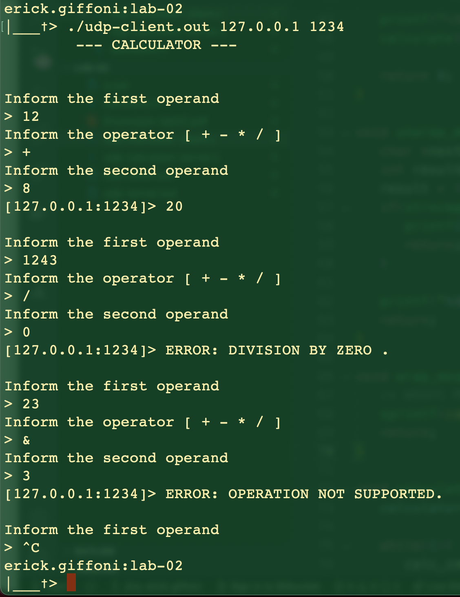
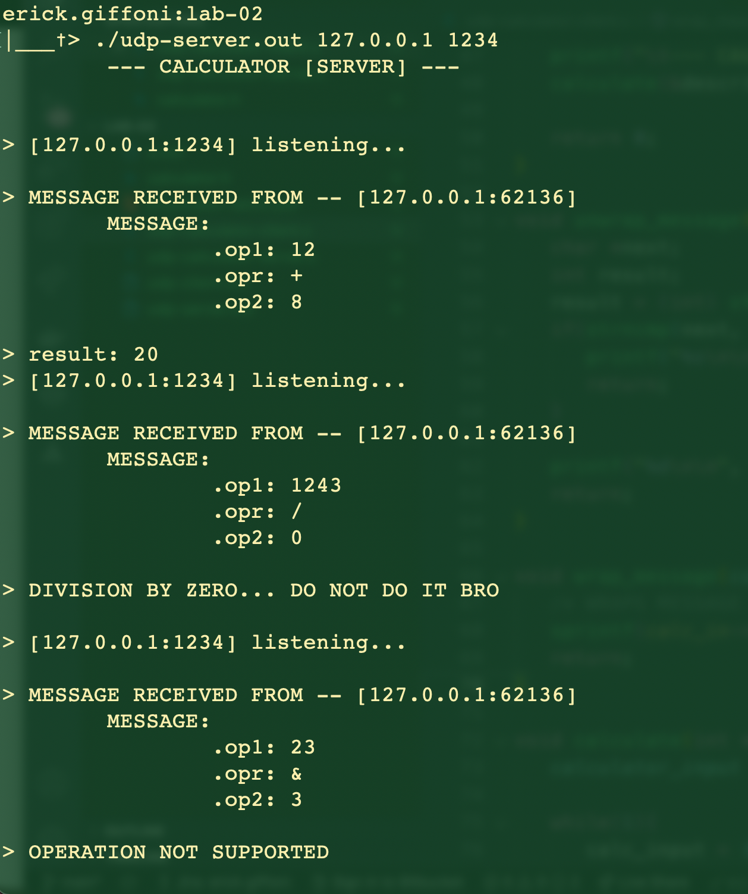

# Lab02 – Construindo aplicações distribuídas usando SOCKETS


Universidade de Brasília | Faculdade do Gama

Programação para sistemas paralelos e distribuídos - PSPD

Erick Giffoni - 170141161

08/2021


## Introdução


Este laboratório tem como objetivo exemplificar, por meio de uma <br>
aplicação simples, o uso de SOCKETS (*File Descriptor for an Endpoint Communication*) <br>
em linguagem C.


A arquitetura utilizada segue o modelo cliente-servidor. Sendo assim, o <br>
cliente envia mensagems para o servidor, e este executa a operação requisitada <br>
e devolve uma resposta.


## A solução


No contexto desse laboratório, foi construída uma calculadora <br>
simples, a qual realiza as 4 operações básicas da matemática. <br>
O módulo cliente lê a entrada do usuário, monta uma mensagem <br>
estruturada segundo um padrão definido na ```calculator.h```, <br>
e a envia para o servidor, por meio de uma socket, o qual a recebe <br>
faz a desestruturação da mensgagem em parâmetros, efetua o cálculo, <br>
estrutura a resposta e a devolve para o cliente.


Para esse laboratório, duas soluções foram desenvolvidas: uma **UDP** <br>
e uma **TCP**. Ambas funcionam de modo muito semelhante, o que as difere <br>
são particuliaridades da camada de transporte na comunicação.


> Imagem 1: cliente UDP em execução




> Imagem 2: servidor UDP respondendo o cliente




A solução UDP utiliza um socket **datagrama** enquanto a TCP utiliza um socket <br>
**stream**. No primeiro caso, são usadas as diretivas ```bind```, ```recvfrom``` <br>
e ```sendto```. Já no outro caso, utiliza-se ```bind```, ```connect```, ```listen```, <br>
```send```, ```recv```, ```accept``` e ```fork```. Por causa dessa última, a <br>
aplicação **TCP** funciona em **half-duplex**.


Na solução **TCP**, foi implementado uma lógica para que o servidor perceba que o <br>
cliente de desconectou. Quando este envia um **SIGINT** (CTRL + C), o servidor <br>
recebe esse sinal por meio da diretiva ```signal``` e encerra a conexão, conforme <br>
estabelecido pelo protocolo em qestão.


## Uso

- Compilação UDP:

   - ```gcc udp-calculator-server.c -o udp-server.out``` <br>
   - ```gcc udp-calculator-client.c -o udp-client.out``` <br>

- Compilação TCP:

   - ```gcc tcp-calculator-server.c -o tcp-server.out``` <br>
   - ```gcc tcp-calculator-client.c -o tcp-client.out``` <br>


- Executar o servidor antes do cliente: ```./tcp-server.out <ip> <porta>``` ou ```./udp-server.out <ip> <porta>``` <br>


- Executar o cliente: ```./tcp-client.out <ip do servidor> <porta do servidor>``` ou ```./udp-client.out <ip do servidor> <porta do servidor>``` <br>


- Para parar a execução dos programas: ```CTRL + C``` <br>


## Opinião geral


O primeiro laboratório que fizemos foi usando a ferramenta *rpcgen*, a qual atua <br>
como um *middleware* entre a aplicação e a camada de transporte. Dessa vez, a <br>
utiização das *sockets* mostra-se mais difícil e de complexidade maior quando <br>
comparada com a facilidade de usar **RPC**, pois trata diretamente com a camada <br>
de transporte, deixando a responsabilidade dessa tratativa para o programador.


Eu, particularmente, gostei bastante dos dois experimentos, apesar das dificuldades <br>
inerentes às ferramentas e diretivas de programação, bem como a carga de trabalho <br>
que ambas propostas (lab-01 e lab-02) requerem.


Ainda, usar a *rpcgen* é mais cômodo do que usar *sockets*, do ponto de vista <br>
da programação na camada de transporte. Entretanto, aquela ferramenta <br>
tem suas particularidades que requerem um trabalho de refatoração por parte do <br>
programador.


Como comentário final, para a construção de uma aplicação maior e mais complexa <br>
que uma simples calculadora, penso que seria MUITO mais complicado lidar com o <br>
envio das mensagens entre cliente e servidor, seja usando **RPC** ou **sockets**. <br>
Para tanto, dada a complexidade dessa suposta aplicação, seria de grande valia <br>
a utilização de alguma biblioteca ou API que encapsulasse o tratamento e o envio <br>
das mensagens de maneira simples.
